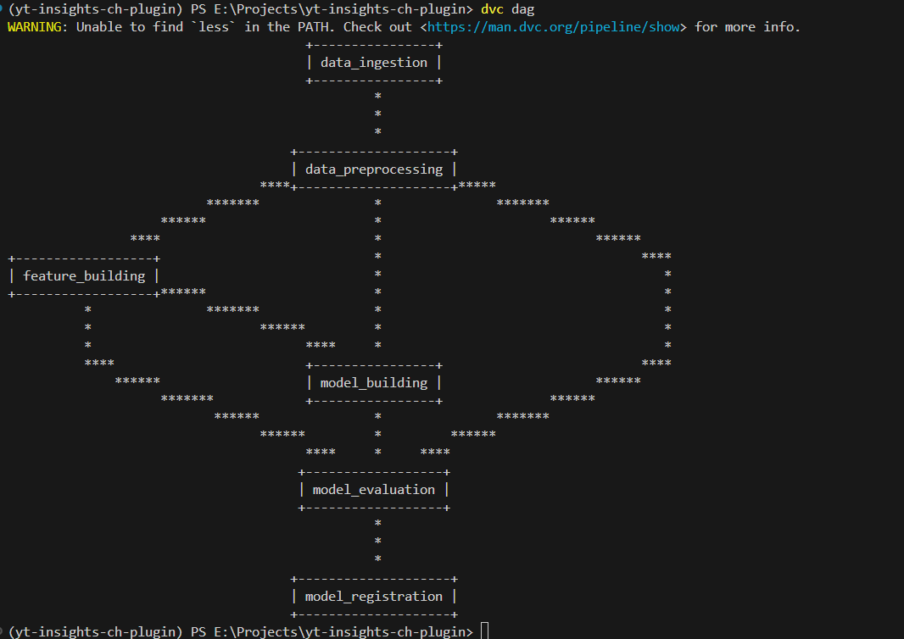

# 🎬 Youtube Insights Chrome Plugin

<a target="_blank" href="https://cookiecutter-data-science.drivendata.org/">
    
</a>

A Chrome extension that gives you instant insights on YouTube videos by analyzing their comments using an end-to-end machine learning pipeline.

Built with modern MLOps practices, the application integrates:

- ⚙️ **MLFlow** for experiment & model tracking & registry/deployment
- 🧪 **DVC** for data versioning and pipeline
- 🐳 **Docker** for containerization
- 🔁 **CI/CD pipelines** for automated deployment
- ☁️ **AWS EC2, S3, and ECR** for scalable cloud infrastructure

This plugin connects to a locally running Flask API (or a cloud-deployed endpoint) to process YouTube video comments, perform sentiment analysis, and visualize keyword patterns—all in real-time within the YouTube interface.

🔧 Features

- Sentiment analysis of YouTube comments

- Word cloud and keyword frequency visualizations

- Real-time insights within YouTube

- Uses YouTube Data API v3

🚀 Getting Started

How to run the backend API (Flask + ML model)

How to install and use the Chrome extension locally

🔐 YouTube API Key Setup
Step-by-step guide to get an API key from Google Cloud Console

🐳 Docker Deployment
Build and run backend container

Optional: Push to AWS ECR

⚙️ CI/CD & Cloud Infra
How CI/CD is set up (GitHub Actions, etc.)

AWS deployment architecture


## 🗃️ Project Organization / Folder Structure

```
├── LICENSE            <- Open-source license if one is chosen
├── Makefile           <- Makefile with convenience commands like `make data` or `make train`
├── README.md          <- The top-level README for developers using this project.
├── client             <- Frontend code for Youtube extension
│   ├── README.md       
│   ├── manisfest.json        
│   ├── popup.html      
│   └── popup.js        
├── data
│   ├── external       <- Data from third party sources.
│   ├── interim        <- Intermediate data that has been transformed.
│   ├── processed      <- The final, canonical data sets for modeling.
│   └── raw            <- The original, immutable data dump.
│
├── docs               <- A default mkdocs project; see www.mkdocs.org for details
│
├── models             <- Trained and serialized models, model predictions, or model summaries
│
├── notebooks          <- Jupyter notebooks. Naming convention is a number (for ordering),
│                         the creator's initials, and a short `-` delimited description, e.g.
│                         `1.0-jqp-initial-data-exploration`.
│
├── pyproject.toml     <- Project configuration file with package metadata for 
│                         youtube_insights_chrome_plugin and configuration for tools like black
│
├── references         <- Data dictionaries, manuals, and all other explanatory materials.
│
├── reports            <- Generated analysis as HTML, PDF, LaTeX, etc.
│   └── figures        <- Generated graphics and figures to be used in reporting
│
├── requirements.txt   <- The requirements file for reproducing the analysis environment, e.g.
│                         generated with `pip freeze > requirements.txt`
│
├── setup.cfg          <- Configuration file for flake8
│
├── server             <- Backend API code
│
|    ├── app.py
|
|    ├── requirements.txt
└── src                <- Source code for use in this project.
|    ├── data                   
|        ├── data_ingestion.py        <- Code to download and generate data
|        │
|        ├── data_preprocessing.py    <- Code to process data
|        │
|    ├── features
|        ├── feature_building.py     <- Code to create features for modeling
|        │
|    ├── model
|        ├── model_building.py            <- Code to train models
|        │
|        ├── model_evaluation.py          <- Code to run model inference with trained models
|        │
|        ├── model_registry.py            <- Code to register model
|        │
   
```

--------


#### DVC PIPELINE



#### Frontend View (Ex.)


#### Environment Set (Local)

- conda create -n yt-insights-ch-plugin python=3.11
- conda activate yt-insights-ch-plugin
- pip install -r requirements.txt
- git init
- git remote add 
- git add .
- git commit -m "initial commit"
- git push
- dvc init

#### AWS IAM User

- Create a new user with administrator access in aws and get its access key and secret key and region
- Install AWS cli locally in terminal with boto 3 and run aws configure to set your ACCESS and SECRET ACCESS Key and REGION

#### Setting Up EC2 instance for MLFlow

- sudo apt update: Updates the package list.
- sudo apt install python3-pip: Installs pip for Python 3.
- sudo apt install pipx: Installs pipx for managing Python applications.
- sudo pipx ensurepath: Ensures pipx path is added to the environment.
- pipx install pipenv: Installs pipenv using pipx.
- export PATH=SPATH:/home/ubuntu/local/bin: Temporarily adds pipenv to the PATH.
- echo 'export PATH=$PATH:/home/ubuntu/local/bin'>>~/.bashre: Permanently adds pipenv to the PATH.
- source ~/.bashre: Applies the changes made to bashre.
- mkdir miflow: Creates a new directory for the project.
- cd miflow: Navigates into the project directory.
- pipenv shell: Creates and activates a new virtual environment.
- pipenv install setuptools: Installs setuptools to ensure pkg_resources is available.
- pipenv install miflow: Installs MLflow.
- pipenv install awscli: Installs AWS CLI.
- pipenv install boto3: Installs Botos for AWS SDK..
- aws configure: Configures AWS credentials.(your AWS IAM credentials)
- Aws-key : 
- Aws-secret-key : 
- Aws-region : 
- Mlflow server -h 0.0.0.0 –default-artifiact-root s3://your-s3-storage-name : Starts the MLFlow server on EC2 instance
- Set following in code :
    - export MLFLOW _TRACKING _URI=http://:5000/: Sets the MLflow tracking URI in the terminal.
    - miflow.set _tracking_uri("http://:5000/"'): Sets the MLflow tracking URI in your code.

#### CodeDeploy Launch Template

```bash
#!/bin/bash

# Update the package list
sudo apt-get update -y

# Install Ruby (required by the CodeDeploy agent)
sudo apt-get install ruby -y

# Download the CodeDeploy agent installer from the correct region
wget https://aws-codedeploy-ap-southeast-2.s3.ap-southeast-2.amazonaws.com/latest/install

# Make the installer executable
chmod +x ./install

# Install the CodeDeploy agent
sudo ./install auto

# Start the CodeDeploy agent
sudo service codedeploy-agent start

sudo service codedeploy-agent status	# on asg instance connect command line
```

#### commands to run on ec2 machine connect terminal (yt-plugin-ec2-ecr-cicd) :

	1. sudo apt-get update
	2. sudo apt-get install -y docker.io
	3. sudo systemctl start docker
	4. sudo systemctl enable docker
	5. sudo apt-get install -y unzip curl
	6. curl "https://awscli.amazonaws.com/awscli-exe-linux-x86_64.zip" -o "awscliv2.zip"
	7. unzip awscliv2.zip
	8. sudo ./aws/install
	9. sudo usermod -aG docker ubuntu
	10. exit
	11. reconnect to terminal to check and type : docker --version

#### Docker run command

docker run -p 8888:5000 -e AWS_ACCESS_KEY_ID=YOUR-ACCESS_KEY -e AWS_SECRET_ACCESS_KEY=YOUR-SECRET-ACCESS_KEY niweshbaraj/yt-insights-ch-plugin
